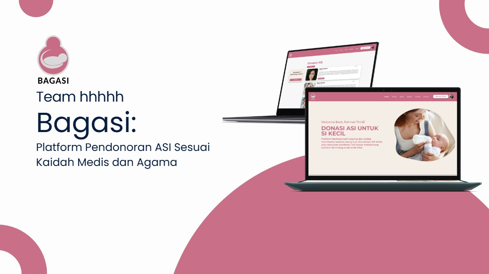

# Bagasi

BAGASI adalah platform yang memfasilitasi pendistribusian ASI secara aman
dan sesuai kaidah medis serta agama untuk mendukung hak tumbuh
kembang anak. BAGASI hadir mengatasi kesenjangan akses ASI bagi ibu yang
kesulitan memberi ASI karena alasan kesehatan, ekonomi maupun edukasi.
Selain itu, BAGASI memberikan edukasi mengenai pentingnya ASI, penyimpanan
yang aman, serta manfaat solidaritas dalam mendukung sesama ibu
menyusui.

dipersiapkan oleh hhhhh

## 📕 Objective
1. Menciptakan jaringan
dukungan bagi ibu-ibu
yang membutuhkan ASI,
sehingga tak ada lagi bayi
yang kekurangan asupan
nutrisi vital.
2. Mengatasi masalah
Produksi ASI berlebih yang
dapat menyebabkan
ketidaknyamanan, infeksi
seperti mastitis, serta risiko
penurunan kesehatan
payudara
3. Mengedukasi masyarakat
tentang pentingnya ASI
bagi kesehatan bayi,
sehingga meningkatkan
kesadaran akan hak
tumbuh kembang anak

## 🧰 Features
1. Pencarian Pendonor Berdasarkan
Lokasi Terdekat:
  *Fitur pencarian yang memungkinkan resipien
menemukan pendonor ASI berdasarkan lokasi terdekat
untuk memudahkan proses donasi
2. Riwayat Donasi dan Reward:
   *Sistem yang melacak riwayat donasi ASI dan
penerimaannya oleh resipien, serta memberikan
penghargaan atau reward kepada pendonor.
3. Pusat Edukasi
   *Menyediakan artikel, panduan, dan informasi edukatif
mengenai pentingnya donor ASI, manfaatnya, serta tips
menjaga kesehatan bagi pendonor dan resipien

## ⚡ Getting Started

Untuk menjalankan proyek ini secara lokal, ikuti langkah-langkah di bawah ini:

### 👀 Installation

1. kloning repository:
   ```
   $ git clone https://github.com/gilanghuda/Bagasi
   ```

2. Navigasi ke direktori proyek:
   ```
   $ cd Bagasi
   ```

3. Instal dependensi yang diperlukan:
   ```
   $ npm install
   ```
## 🔧 Development

Here is a description of our application's development process.

## ⚙ Tech Stack

| Technology     | Purpose                                                                          |
|----------------|----------------------------------------------------------------------------------|
| *Node JS*      | Platform berbasis JavaScript untuk menjalankan aplikasi di server.               |
| *Express*      | Framework minimalis untuk membangun aplikasi web dan API dengan Node.js.         |
| *PosgreSql*    | Sistem manajemen basis data relasional open source yang mendukung SQL            |
| *Postgis*      | Ekstensi PostgreSQL untuk mendukung data geospasial.                             |
| *JavaScript*   | Digunakan untuk pengembangan aplikasi berbasis web di sisi client dan server     |
| *Tailwind*     | Framework CSS utility-first yang mempermudah styling elemen UI                   |

## 📚 Figma
https://www.figma.com/design/MnyCU0gSbUrsisOw573JDt/Projek_Hology?node-id=0-1&node-type=canvas&t=1OrA8J5D3S4LBsXN-0

## 🐨 Credit

1. Gilang Fachrul Huda
2. Rachmat Thirdi Maliki
3. M. Fahrezel Ravie Iskandar

## 🔒 License

© tim hhhhh - 2024
